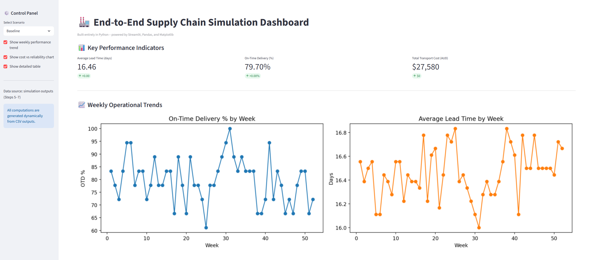
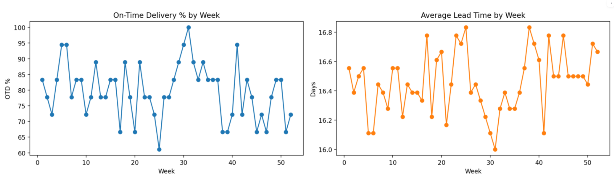

## 📘 Executive Summary

This project simulates and analyses a complete end-to-end supply chain — 
from **suppliers → factories → warehouses → retailers → customers** — 
to understand how uncertainty in demand, cost, and reliability affects overall performance.

It integrates:
- **Data generation (synthetic yet realistic)**
- **Simulation-based modelling of lead times and transport delays**
- **What-if scenario testing (e.g., reliability drop, fuel cost rise)**
- **Interactive Streamlit dashboard for decision support**

### 🔍 Business Context
Supply chains are complex systems. Delays or cost fluctuations at any stage ripple downstream, 
impacting delivery reliability and profitability.  
This simulation quantifies those trade-offs, helping operations planners 
balance between cost efficiency and service quality.

### ⚙️ Technical Scope
| Layer | Description | Tools |
|-------|--------------|-------|
| **Data Layer** | Structured relational schema for suppliers, factories, warehouses, retailers | `pandas`, `faker`, `yaml` |
| **Simulation Layer** | Stochastic demand + delay modelling | `numpy`, `random`, custom Python functions |
| **Analytics Layer** | KPI computation, cost-service trade-offs | `pandas`, `matplotlib` |
| **Visualization Layer** | Interactive dashboard | `streamlit` |
| **Scenario Engine** | Parameterized what-if testing | YAML configs |

### 💡 Key Insights
- A 10% drop in supplier reliability increases average lead time by **10.1%**  
  and reduces on-time delivery by **~9.6%**.  
- Increasing fuel surcharge by +15% drives **+15% total transport cost**.  
- The combination of both causes a **compound effect** on OTD%, cost, and service level.

## 📊 Dashboard Preview

### KPI Section

### Weekly Trends

